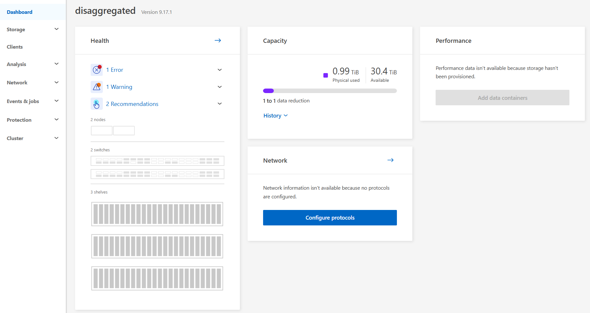
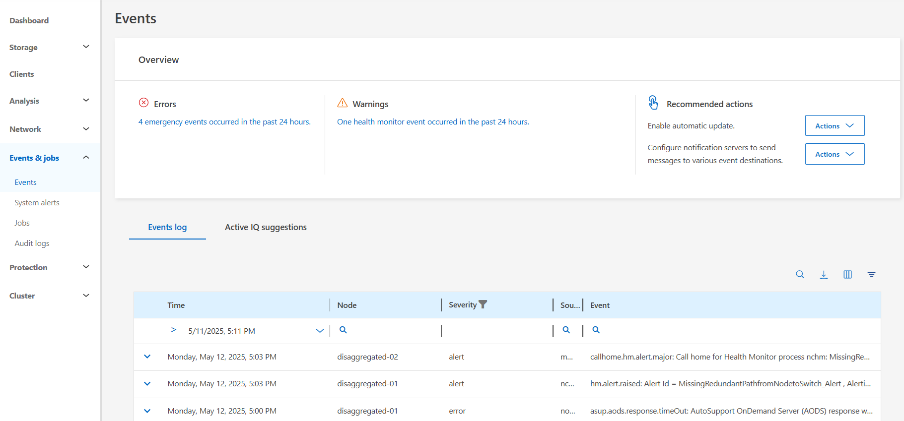
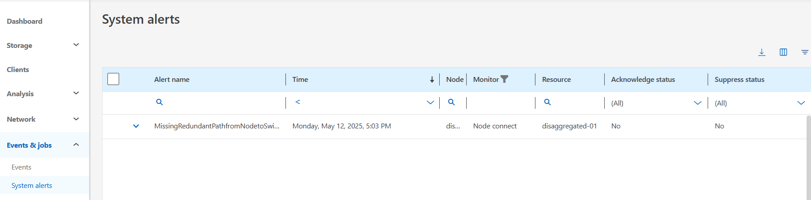
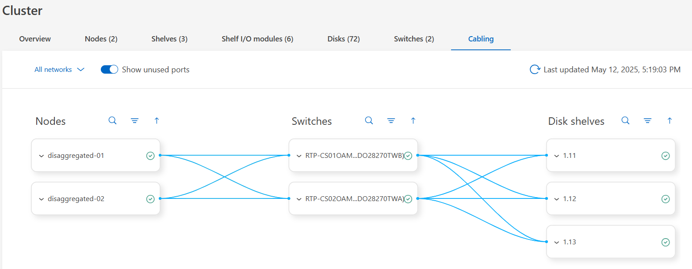
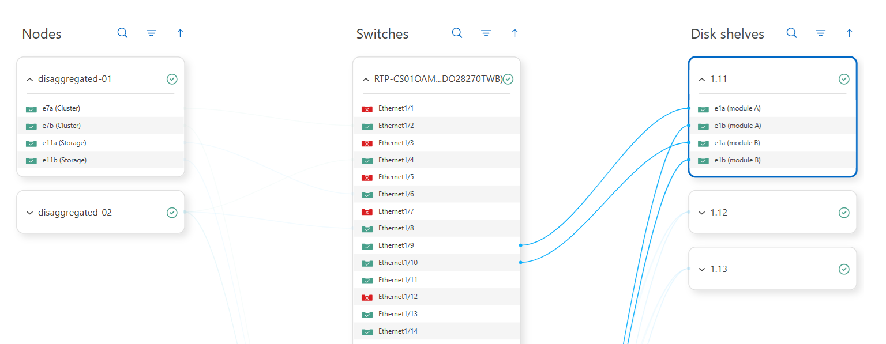

= Test 1: Validate the cluster setup
:toc: left
:toclevels: 4
:sectnums:
:icons: font
:source-highlighter: highlight.js
:doctype: book

xref:test-plans.adoc[← Back to Test Plans]

[[validate-the-cluster-setup]]
== Validate the cluster setup

The first test plan here is to validate the cluster heath, configuration, etc.

[cols="1"]
|===
| *Test plan 1 - Validate the cluster setup*

a| Test procedure – GUI: +
Log into the System Manager GUI via https://[clus_mgmt_IP] +
The system dashboard will show errors, warnings, capacity information, and a high-level overview of the storage hardware.

Click on “Errors” to view any issues the cluster may be having. This will take you to Events & Jobs -> Events.

Click on System Alerts to see specific alerts.

Under Cluster -> Overview, you can see the following via the tabs on the page: +
Node health and information +
Shelves +
Shelf IO modules +
Disks +
Switches +
Cabling +
Scroll through each of these and take note of the different components in the NetApp AFX architecture.

*Note:* You can toggle between list view and graphical view on each tab.

The cabling diagram provides a clean view of the clusters physical layout.

Use the down arrows  in each of the Nodes, Switches and Disk Shelves to see their associated ports. Some ports will be unused. To see a consolidate cabling diagram with only the used ports, uncheck “Show unused ports.”

Test procedure – CLI: +
Log in to the NetApp AFX CLI +
Verify cluster health.

[source,console]
----
AFX::*> set advanced
AFX::*> cluster show
AFX::*> system health status show
AFX::*> system health subsystem show
AFX::*> health alert show
----

Ping cluster interfaces to ensure health and connectivity.

[source,console]
----
AFX::*> cluster ping-cluster -node AFX-01
Host is AFX-01
Getting addresses from network interface table...
Cluster AFX-01_clus1 192.168.76.221 AFX-01 e7a
Cluster AFX-01_clus2 192.168.76.228 AFX-01 e7b
Cluster AFX-02_clus1 192.168.76.224 AFX-02 e7a
Cluster AFX-02_clus2 192.168.76.231 AFX-02 e7b
Local = 192.168.76.221 192.168.76.228
Remote = 192.168.76.224 192.168.76.231
Cluster Vserver Id = 4294967293
Ping status:
....
Basic connectivity succeeds on 4 path(s)
Basic connectivity fails on 0 path(s)
................
Detected 9000 byte MTU on 4 path(s):
    Local 192.168.76.221 to Remote 192.168.76.224
    Local 192.168.76.221 to Remote 192.168.76.231
    Local 192.168.76.228 to Remote 192.168.76.224
    Local 192.168.76.228 to Remote 192.168.76.231
Larger than PMTU communication succeeds on 4 path(s)
RPC status:
2 paths up, 0 paths down (tcp check)
2 paths up, 0 paths down (udp check)
----

Show that disk shelves are connected and available.

[source,console]
----
AFX::*> storage shelf show
AFX::*> storage shelf port show
----

Verify the system HA status.

[source,console]
----
AFX::*> system ha interconnect status show
AFX::*> system ha interconnect port show
AFX::*> storage failover show
----

Verify the storage switches are connected and available.

[source,console]
----
AFX::*> system switch ethernet show
----

Show network interfaces.

[source,console]
----
AFX::*> network interface show
----

Show the storage availability zone.

[source,console]
----
AFX::*> storage availability-zone show
----

Show system processor interfaces.

[source,console]
----
AFX::*> service-processor show
----

Show available cluster space.

[source,console]
----
AFX::*> cluster space show
----

Verify the NFS server is configured properly.

[source,console]
----
AFX::*> nfs show -fields v4.1,v4-id-domain,v4.1-pnfs,v4.1-trunking,tcp-max-xfer-size,v3,v3-64bit-identifiers,v4-64bit-identifiers,v3,v4.1-read-delegation,v4.1-write-delegation,rdma
----

The NFS server output should show:

a| Expected outcome(s): +
The cluster is healthy and available. +
The shelves are cabled properly. +
The network interfaces are present for management Ips. +
Storage availability zone concepts are reviewed. +
Cabling diagrams are viewed. +
Error states are not present. If errors are present, resolve with support before moving on to the next sections.

| *Test results:*

| *Test summary:*

| *Comments:*

|===

// navigation-links:start
[cols="1,1",frame=none,grid=none]
|===
| xref:test-plans.adoc[< Previous]
>| xref:test-02-enable-autosupport.adoc[Next >]
|===
// navigation-links:end
