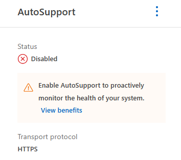
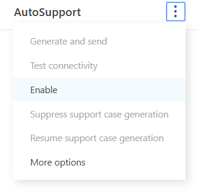
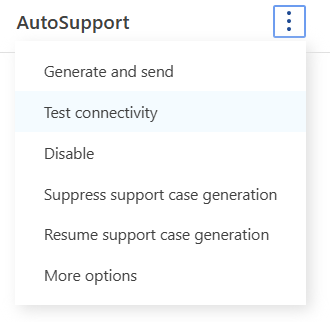
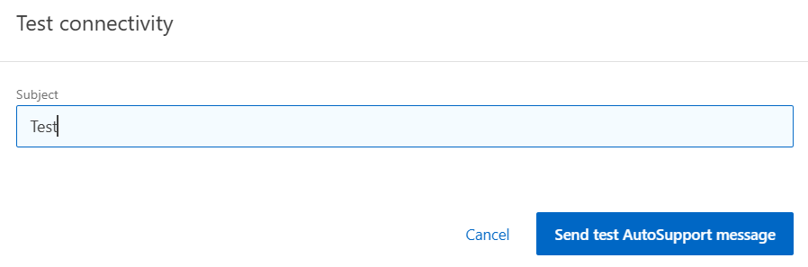

= Test 2: Enable AutoSupport (optional)
:toc: left
:toclevels: 4
:sectnums:
:icons: font
:source-highlighter: highlight.js
:doctype: book

xref:test-plans.adoc[← Back to Test Plans]

[[enable-autosupport-optional]]
== Enable AutoSupport (optional)

AutoSupport is enabled for these environments to ensure the following:
* Proper call home / case creation when needed.
* Data collection for the AFX clusters, including detailed log files.
* Troubleshooting/support
AutoSupport requires the ONTAP system to be able to access the internet to send its payload to NetApp. For environments that do not allow external access please follow this procedure to manually upload an AutoSupport.
For more information on what AutoSupport is, the information that AutoSupport contains, or how to configure AutoSupport, please consult .

[cols="1",%autowidth]
|===
| *Test plan 2 - Enable AutoSupport (optional)*

a| *Test procedure:*

. Log into the System Manager GUI via https://[clus_mgmt_IP] Navigate to Cluster -> Settings. Under AutoSupport, if not already enabled, click the menu and select enable.
+

+

. Test AutoSupport connectivity
+

+

a| *Expected outcome(s):*

* AutoSupport is enabled.
* A test ASUP succeeds.
| *Test results:*

| *Test summary:*

| *Comments:*

|===

// navigation-links:start
[cols="1,1",frame=none,grid=none]
|===
| xref:test-01-validate-cluster-setup.adoc[< Previous]
>| xref:test-03-create-network-interfaces.adoc[Next >]
|===
// navigation-links:end
