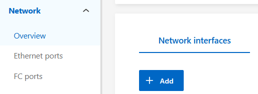
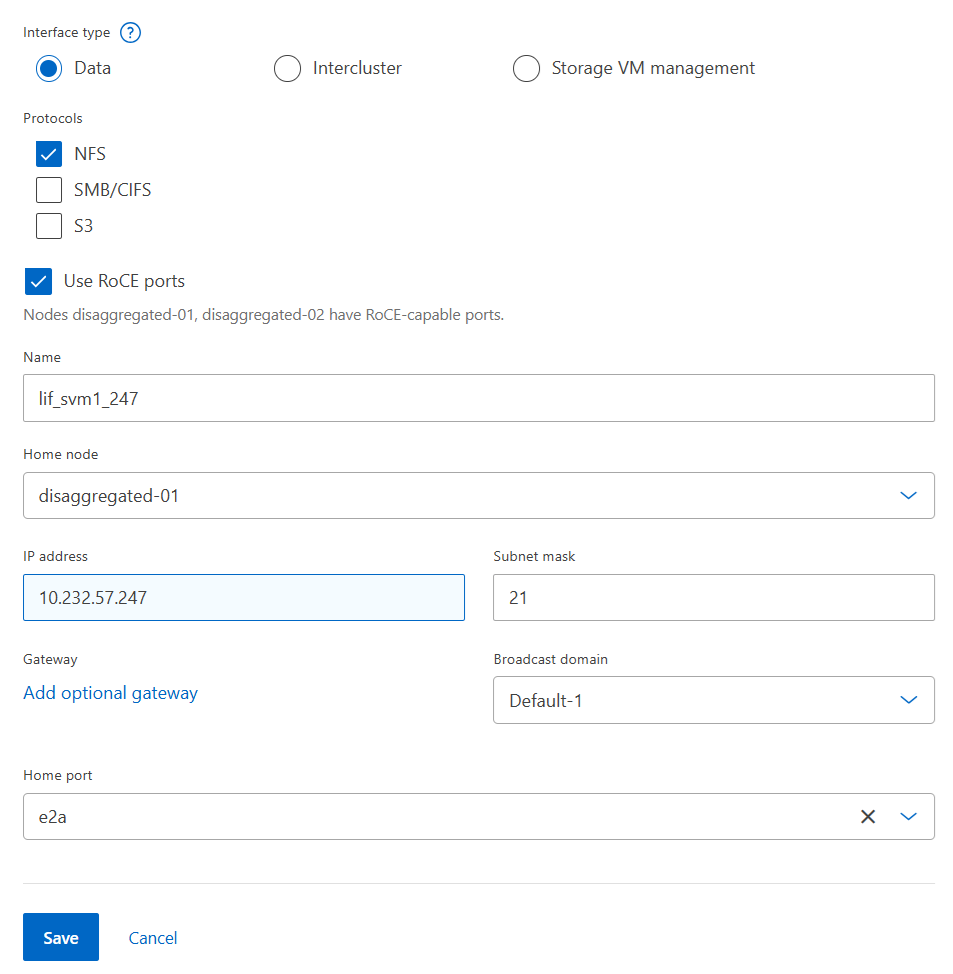

= Test 3: Create network interfaces
:toc: left
:toclevels: 4
:sectnums:
:icons: font
:source-highlighter: highlight.js
:doctype: book

xref:test-plans.adoc[← Back to Test Plans]

[[create-network-interfaces]]
== Create network interfaces

ONTAP can be configured with multiple network interfaces for management, data access and inter-cluster connectivity.

[cols="<1",width="100%"]
|===
<| *Test plan 3 - Create network interfaces*

a| *Test procedure:*

. Log into the System Manager GUI via https://[clus_mgmt_IP] Navigate to Network -> Overview. Click the “+ Add” button under Network interfaces.
+

. Select “data” for the interface type and select the desired options, specify a name, home node, etc.
+

. Repeat the above step for each node. Create at least 2 data interfaces per node to provide paths for NFS session trunking. Alternately, use the LIF creation script found in the Appendix of this document.
+
*Note:* Benchmarking networking scripts are available here: xref:scripts.adoc#nas-performance-benchmark-scripts-benchmarkingontap-repo[LIF creation and cleanup scripts].

a| *Expected outcome(s):*

* Two or more data interfaces are created per node.
|===

// navigation-links:start
[cols="1,1",frame=none,grid=none]
|===
| xref:test-02-enable-autosupport.adoc[< Previous]
>| xref:test-04-data-migration.adoc[Next >]
|===
// navigation-links:end
