= Test 4: Data migration (optional)
:toc: left
:toclevels: 4
:sectnums:
:icons: font
:source-highlighter: highlight.js
:doctype: book

xref:test-plans.adoc[← Back to Test Plans]

[[data-migration-optional]]
== Data migration (optional)

The goal for this test is to provide a mechanism to display the ease and speed of migration of data from unified ONTAP to NetApp AFX using NetApp SnapMirror technology. This test is optional if you plan on generating your own datasets on the cluster.
Additionally, we can also show how NetApp AFX can replicate to a unified ONTAP system to provide a cost-effective way to provide disaster recovery, provided the SnapMirror version requirements are met.

[cols="<1",width="100%"]
|===
<| *Test plan 4 - Data migration (optional)*

a|
*Contents:*

* <<t04-manage-intercluster-network-interfaces,Manage intercluster network interfaces>>
* <<t04-cluster-and-svm-peering,Cluster and SVM peering>>
* <<t04-establish-snapmirror-afx-to-unified-ontap,Establish SnapMirror from AFX to unified ONTAP>>
* <<t04-create-snapmirror-cli-steps,Create SnapMirror - CLI steps>>
* <<t04-verify-snapmirror-status-gui-steps,Verify SnapMirror status - GUI steps>>
* <<t04-verify-snapmirror-status-cli-steps,Verify SnapMirror status - CLI steps>>
* <<t04-break-the-snapmirror,Break the SnapMirror>>
* <<t04-establish-snapmirror-from-unified-ontap-to-afx,Establish SnapMirror from unified ONTAP to AFX>>
* <<t04-reverse-resync-snapmirror,Reverse resync SnapMirror>>

[[t04-manage-intercluster-network-interfaces]]
*Manage intercluster network interfaces*
[start=1]
. Ensure intercluster interfaces exist. Click Network -> Overview.
+
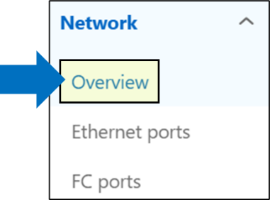

. Click the magnifying glass to search for interfaces with the type of "intercluster."
+

. Type "intercluster" in the search field to find any intercluster interfaces. If there are none, move on to the next step to create intercluster interfaces. If they do exist, move to the following step to set up the cluster peer.

. Create intercluster interfaces (if they do not already exist). Each node in both clusters should have at least one intercluster interface.

. Navigate to Protection -> Overview and click "Add network interfaces."
+
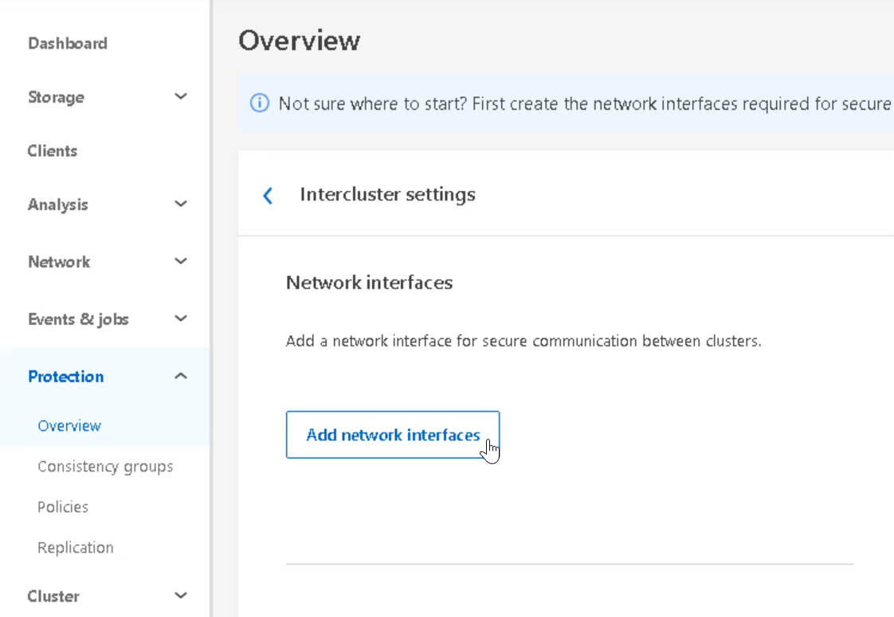

. Configure the interfaces for each node, as shown below.
+
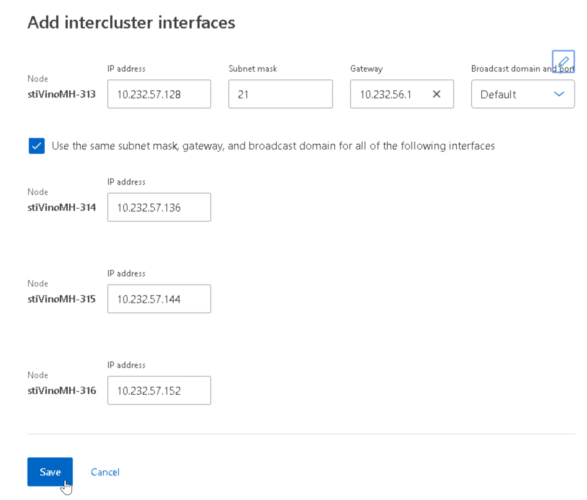

. Click save and confirm the interfaces.
+
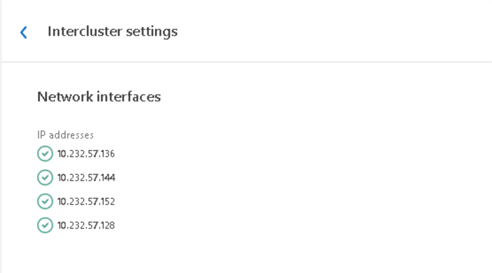

. Verify the interfaces have been created from the "Network interfaces overview."
+
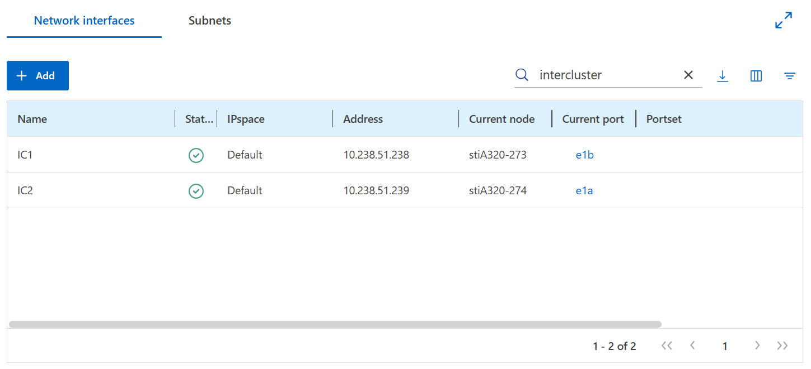
+
*Note:* If necessary, make any edits to interfaces here.

[[t04-cluster-and-svm-peering]]
*Cluster and SVM peering*
[start=1]
. Add a cluster peer via System Manager on the source ONTAP cluster. Navigate to Protection -> Overview.
+
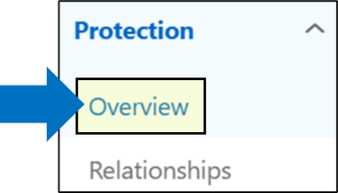

. Click the menu next to "Cluster peers" and click "Add cluster peers" or click the "Add a cluster peer" button.
+
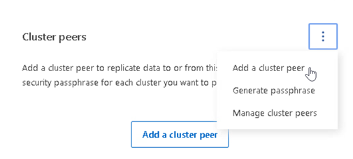

. To peer to a remote cluster, a passphrase will be needed. Click "Launch remote cluster."
+
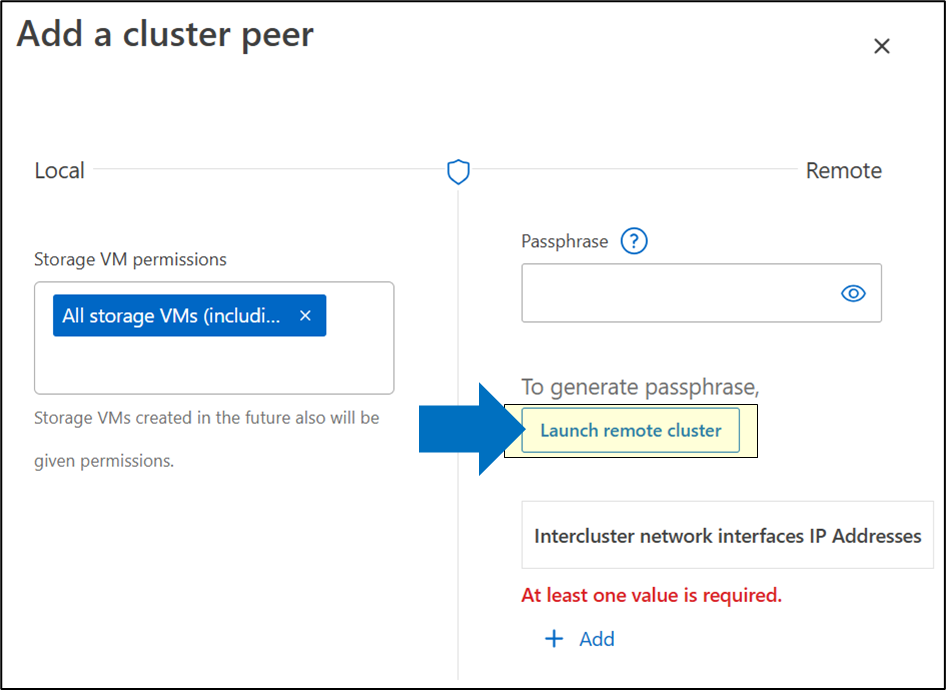

. Add the remote cluster management IP address and click "Launch."
+
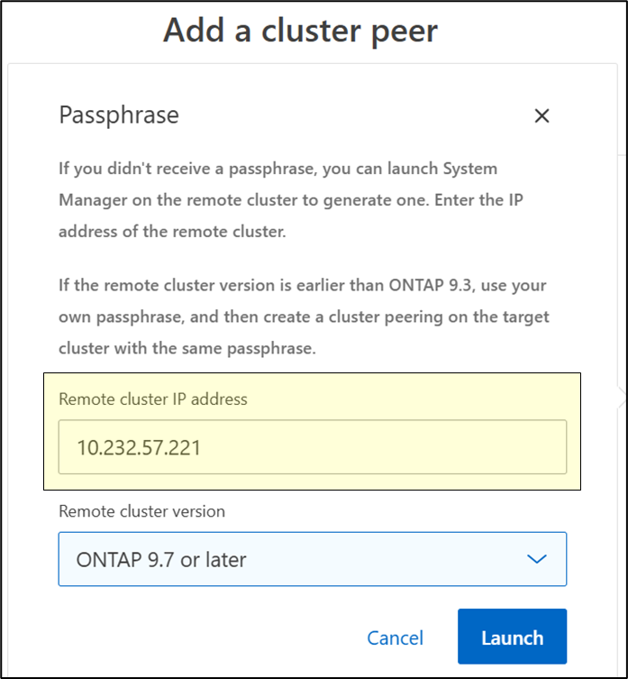

. Generate passphrase. This will open a new window to the NetApp AFX cluster to generate a new passphrase for cluster peer authentication. From here, copy the passphrase and add it to the unified ONTAP system.
+
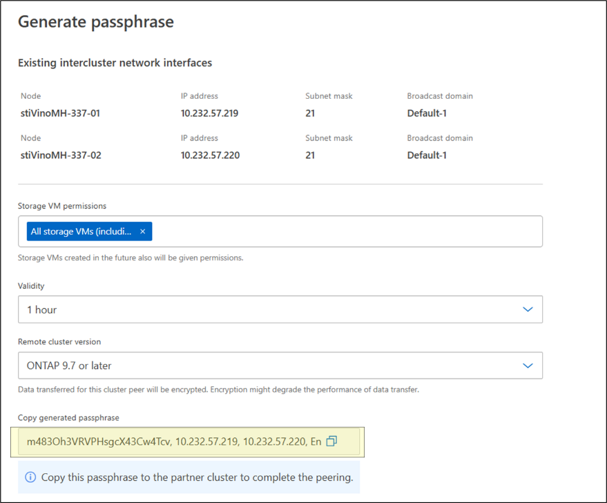

. Add the passphrase. Verify the intercluster IP addresses for the NetApp AFX cluster are populated. If everything looks good, click "Initiate cluster peering."
+
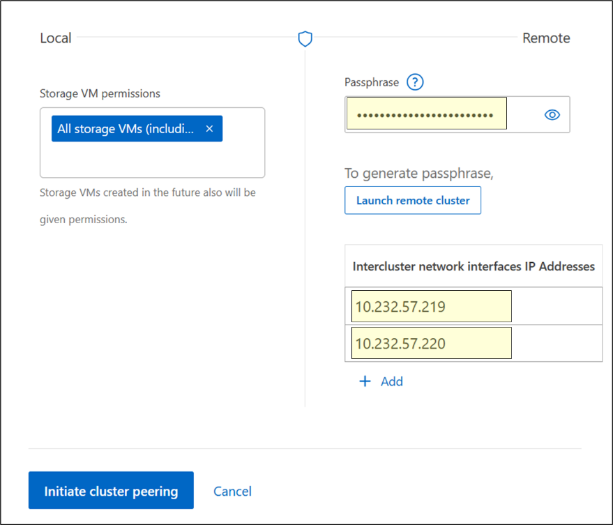

. Verify the cluster peer status. If successful, you will see cluster peers listed under Protection -> Overview. Initially, the peer may show as "partial" with a red X next to the name. This can happen when the peer job is finishing. Eventually, the status should show a green check.
+
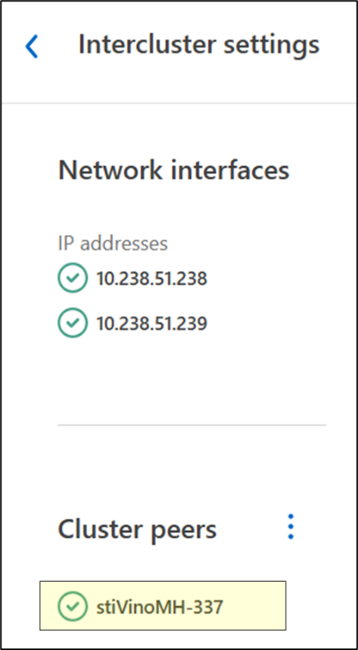

. Verify cluster and SVM peering status from the CLI.
+
[source,console]
----
AFX::*> cluster peer health show
AFX::*> vserver peer show
----

[[t04-establish-snapmirror-afx-to-unified-ontap]]
*Establish SnapMirror from AFX to unified ONTAP*
[start=1]
. Use a source volume with production datasets on the NetApp AFX cluster and replicate to the unified ONTAP cluster. Navigate to Storage -> Volumes.
+
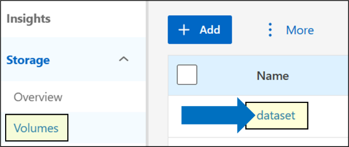

. Hover over the volume name and click to expand the menu. Select "Protect."
+
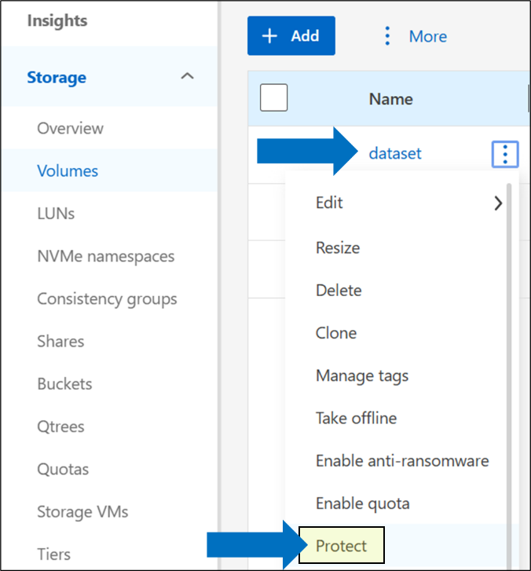

. Configure the SnapMirror settings and click "Protect."
+
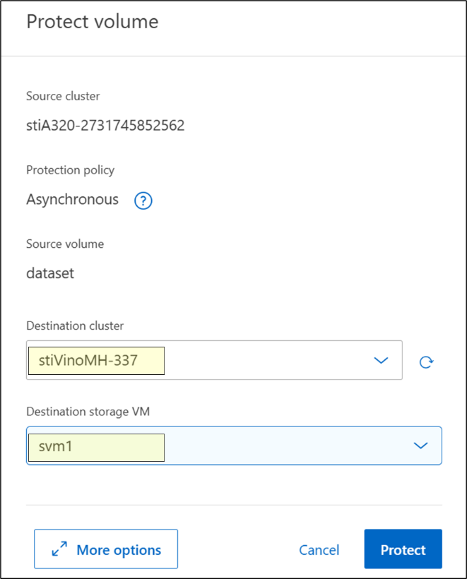

*Note:* If the above GUI steps fail, you can attempt to create the relationship via the CLI.

[[t04-create-snapmirror-cli-steps]]
*Create SnapMirror - CLI steps*
[start=1]
. Check the constituent count on the source volume's FlexGroup volume. SnapMirror of FlexGroup volumes will require identical constituent counts on source and destination.
+
[source,console]
----
AFX::> set advanced; volume show -vserver vs0 -volume dataset -fields constituent-count
----

. Create a FlexGroup on the destination cluster. The volume will need the same number of constituent volumes with equal/greater size and a type of "DP."
+
[source,console]
----
AFX::> set advanced; vol create -volume dataset_dst -state online -size 2T -type DP -number-of-constituents [number from previous step]
----

. Create the SnapMirror relationship.
+
[source,console]
----
AFX::> snapmirror create -source-path vs0:dataset -destination-path svm1:dataset_dst -vserver svm1 -throttle unlimited
----

. Initialize the SnapMirror.
+
[source,console]
----
AFX::> snapmirror initialize -destination-path svm1:dataset_dst
----

. Verify replication is progressing and eventually completed. Optional: leverage EMS to send email notification when the SnapMirror job is completed.

[[t04-verify-snapmirror-status-gui-steps]]
*Verify SnapMirror status*

*GUI steps:*
[start=1]
. Navigate to Protection -> Replication.
+
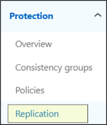

. Click on the SnapMirror relationship.
+
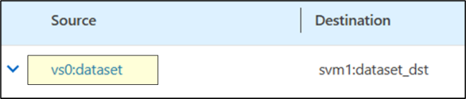

. Verify the status (health, state, and last transfer status).
+
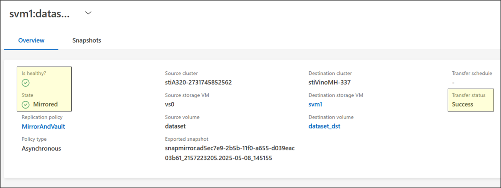

[[t04-verify-snapmirror-status-cli-steps]]
*CLI steps:*
[start=1]
. Check the current snapmirror status.
+
[source,console]
----
AFX::*> snapmirror show
                                                                       Progress
Source            Destination Mirror  Relationship   Total             Last
Path        Type  Path        State   Status         Progress  Healthy Updated
----------- ---- ------------ ------- -------------- --------- ------- --------
vs0:dataset XDP  svm1:dataset_dst
                              Snapmirrored
                                      Idle           -         true    -
----

. Compare source and destination datasets.
+
[source,console]
----
unified::*> vol show -vserver vs0 -volume dataset -fields files-used
vserver volume  files-used
------- ------- ----------
vs0     dataset 78001
AFX::*> vol show -vserver svm1 -volume dataset_dst -fields files-used
vserver volume      files-used
------- ----------- ----------
svm1    dataset_dst 78001
----

. Compare contents/checksums. For a more accurate comparison, compare the actual contents of both volumes.
+
[source,console]
----
# mount /unifiedONTAPvol
# mount /AFXONTAPvol
# diff -r unifiedONTAPvol/.snapshot/lastcommonsnap/ AFXONTAPvol/
----
+
The command can take considerable time (depending on file count and size), as it reads the entirety of the files. If both volumes are identical, you should see no differences in the listings. If you wish to avoid this potentially lengthy step, use the files-used count comparison from `vol show`.

[[t04-break-the-snapmirror]]
*Break the SnapMirror*
[start=1]
. From NetApp AFX System Manager, navigate to Protection -> Replication.
+
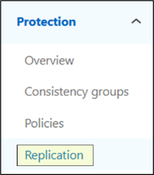

. Hover over the relationship and expand the menu. Select "Break."
+
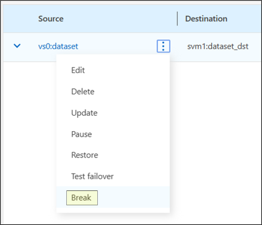

. Confirm the details and click "Break."
+
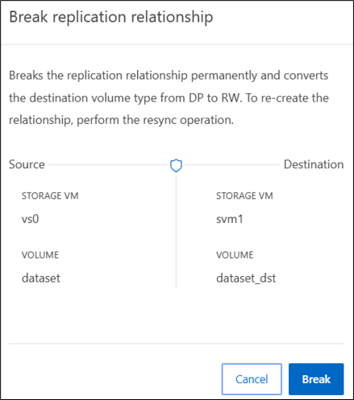

[[t04-establish-snapmirror-from-unified-ontap-to-afx]]
*Establish SnapMirror from unified ONTAP to AFX*
[start=1]
. Start a new SnapMirror from unified ONTAP to NetApp AFX for DR/backup testing.

*Note:* Destination ONTAP cluster will need to be on 9.16.1 or later to allow Advanced Capacity Balancing to be enabled. If it's not possible to use a destination unified ONTAP cluster, use the NetApp AFX cluster as the destination instead.

. New SnapMirror steps: Navigate to Storage -> Volumes, hover over the volume name, and select "Protect."
+
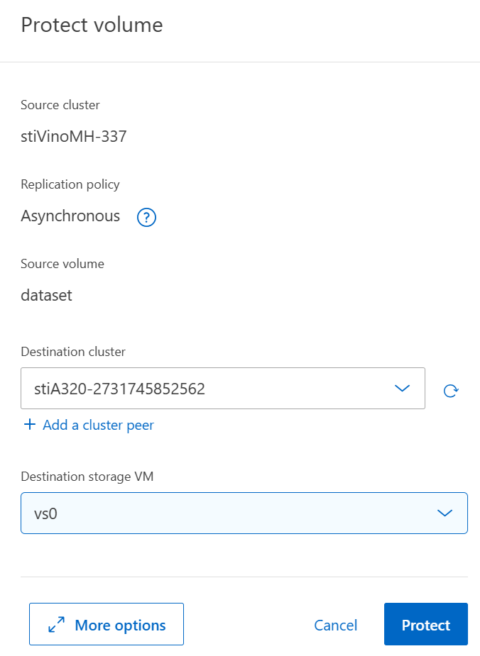

. Review the options and click "Protect."

[[t04-reverse-resync-snapmirror]]
*Reverse resync SnapMirror*
[start=1]
. Navigate to Protection -> Replication.

. Hover over the relationship and expand the menu. Select "Reverse Resync."
+
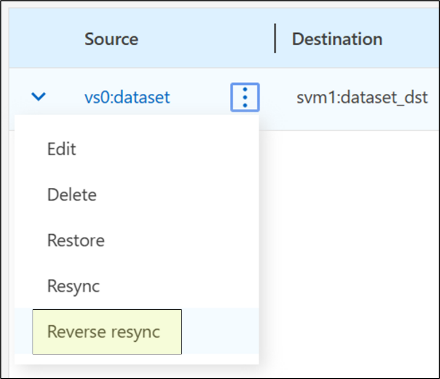

. Verify in the unified ONTAP destination cluster that the relationship appears when navigating to Protection -> Relationships.
+
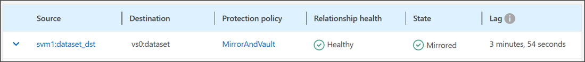

a| *Expected outcome(s):*

* A data protection relationship from unified ONTAP to NetApp AFX is established, and data migration is completed.
* Source and destination volume datasets are compared to verify successful migration.
* SnapMirror relationship is broken; destination volume is verified as writeable and ready for workload testing.
* OPTIONAL: Replicate from NetApp AFX to unified ONTAP
|===

// navigation-links:start
[cols="1,1",frame=none,grid=none]
|===
| xref:test-03-create-network-interfaces.adoc[< Previous]
>| xref:test-05-volume-management.adoc[Next >]
|===
// navigation-links:end
