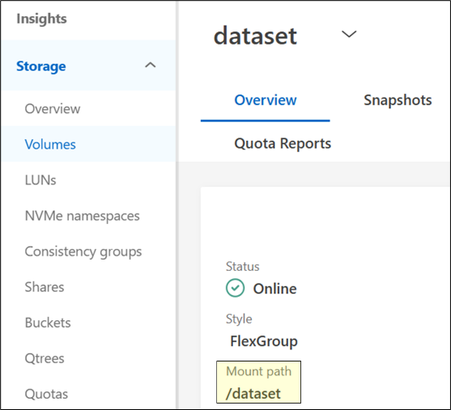

= Test 7: Customer workload testing -- real data
:toc: left
:toclevels: 4
:sectnums:
:icons: font
:source-highlighter: highlight.js
:doctype: book

xref:test-plans.adoc[← Back to Test Plans]

[[customer-workload-testing--real-data]]
== Customer workload testing -- real data

The goal of these workload tests is to show that real data workloads can be ported over to NetApp AFX seamlessly and can potentially provide performance benefits over unified ONTAP -- particularly when growing the compute side of the cluster.

*Note:* For NFS considerations, see the Appendix in this document.

[cols="1"]
|===
| *Test plan 7 - Customer workload testing -- real data*

a| *Test procedure:*

. Mount NetApp AFX volume using NAS protocol of your choice. Mount using NFS or SMB. For best results, use multiple simultaneous clients rather that testing a single client’s performance.

. Find the export path of your data volume in System Manager.
+

. Mount the volume using NFS. Optionally, include the mount path in /etc/fstab or automounter* *Recommended NFS versions and mount options are found in the NFS considerations above. Run designated workloads against existing datasets that have been migrated over from unified ONTAP. While benchmarks are running, move on to Test 5) Performance Monitoring. Test real-world data using everyday workloads. As workloads are running, test the limits of NetApp AFX by adding more clients or more jobs to the workload to push the limits of scale.

a| *Expected outcome(s):*

* Workloads should not need additional configuration or changes to run properly using NetApp AFX.
* Performance should be as good or better than unified ONTAP.
| *Test results:*

| *Test summary:*

| *Comments:*

|===

// navigation-links:start
[cols="1,1",frame=none,grid=none]
|===
| xref:test-06-api-testing.adoc[< Previous]
>| xref:test-08-customer-workload-benchmarks.adoc[Next >]
|===
// navigation-links:end
