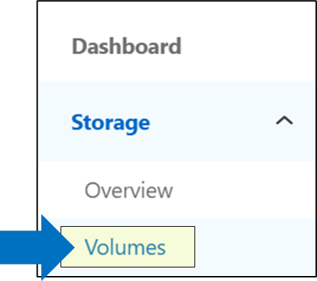
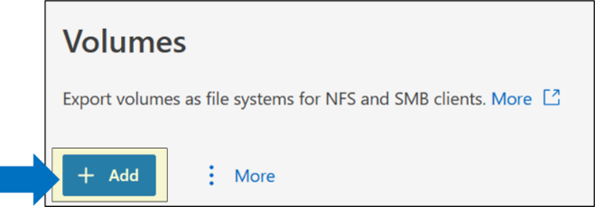
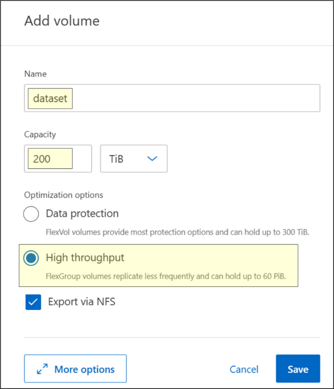
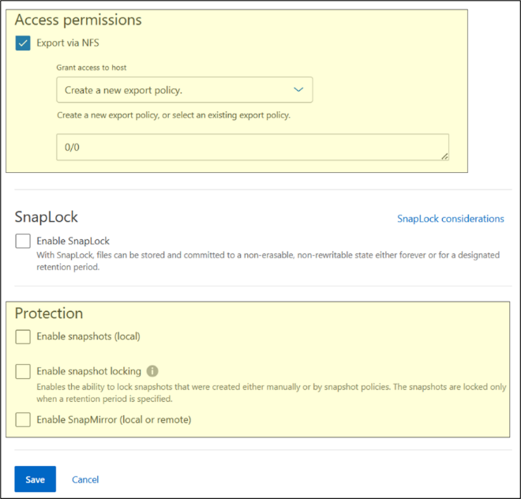

= Test 8: Customer workload testing -- performance benchmarks
:toc: left
:toclevels: 4
:sectnums:
:icons: font
:source-highlighter: highlight.js
:doctype: book

xref:test-plans.adoc[← Back to Test Plans]

[[customer-workload-testing--performance-benchmarks]]
== Customer workload testing -- Performance benchmarks

In lieu of - or in addition to -- testing real data workloads, storage benchmark tests can also be run against the NetApp AFX cluster to display some of the potential performance.
For EDA workloads, we can leverage link:https://www.spec.org/storage2020/[SPEC SFS 2020 / SPECstorage Solution 2020 EDA] for benchmarking. This benchmark can also be used for general testing of small random IO (including high metadata) and larger sequential IO.

For AI/ML workloads, we will leverage link:https://mlcommons.org/benchmarks/storage/[MLPerf Storage (MLCommons)], which can also act as a throughput-specific benchmark.

For details on installing, configuring, and running these benchmarks, see xref:appendix-spec-sfs.adoc[SPEC SFS 2020] and xref:appendix-mlcommons.adoc[MLCommons / MLPerf Storage].

*Note:* For workload performance considerations (NFS, client/network, and ONTAP feature settings), see xref:test-07-08-performance-testing-considerations.adoc[Performance testing considerations (Tests 7 and 8)].

[cols="<1",width="100%"]
|===
a| *Test procedure:*

. Create a FlexGroup volume in the NetApp AFX cluster.

. Navigate to the Storage -> Volumes menu in System Manager
+

. Click + Add
+

. Enter the volume name, capacity and select “High throughput” to create a FlexGroup
+

. Optionally, click “More options” to disable/enable data protection features and add export policies and rules
+

. Click save. Mount NetApp AFX volume using NAS protocol of your choice. Mount using NFS or SMB. For best results, use multiple simultaneous clients rather that testing a single client’s performance.

. Find the export path of your data volume in System Manager.
+
image::images/test-08-image-05.png[width=25%,link=images/test-08-image-05.png]

. Mount the volume using NFS. Optionally, include the mount path in /etc/fstab or automounter* *Recommended NFS versions and mount options are found in the xref:appendix-nfs-considerations.adoc#nfs-considerations[NFS considerations in the Appendix].*

. Generate datasets. For detailed steps on how to run the benchmarks, see the appendix of this document.

. Run benchmarks on datasets. While benchmarks are running, move on to the Performance Monitoring test plan.

a| *Expected outcome(s):*

* Benchmarks should show the performance capabilities of this system.
|===

// navigation-links:start
[cols="1,1",frame=none,grid=none]
|===
| xref:test-07-customer-workload-real-data.adoc[< Previous]
>| xref:test-09-performance-monitoring.adoc[Next >]
|===
// navigation-links:end
