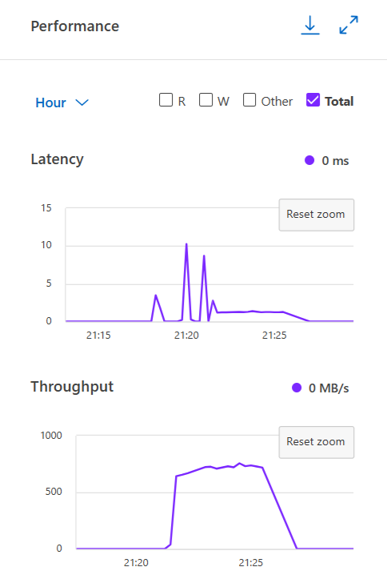
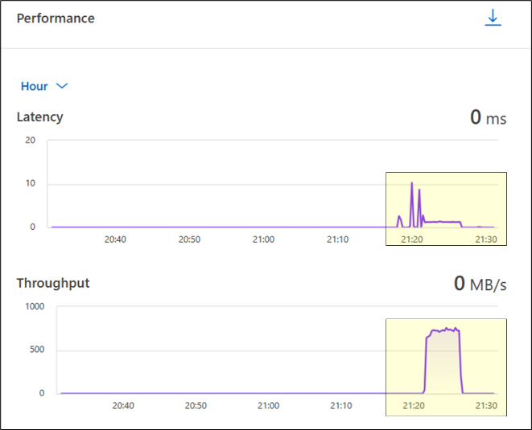

= Test 9: Performance monitoring
:toc: left
:toclevels: 4
:sectnums:
:icons: font
:source-highlighter: highlight.js
:doctype: book

xref:test-plans.adoc[← Back to Test Plans]

[[performance-monitoring]]
== Performance monitoring

The goal of this test is to illustrate the performance monitoring capabilities of NetApp AFX and how it can integrate into current performance monitoring tools used by unified ONTAP and how understanding ONTAP performance should have little to no learning curve from unified ONTAP.
NetApp System Manager can be used for basic performance monitoring and is covered in the test below.
NetApp Harvest can be used to monitor performance at a more advanced level:
link:https://github.com/NetApp/harvest[NetApp Harvest - GitHub]

[cols="<1",width="100%"]
|===
<| *Test plan 9 - Performance monitoring*

a| *Test procedure:*

1. Verify performance tests are running. Performance tests can be real data or benchmarks. From the System Manager GUI, log into System Manager. On the main page, you can see performance graphs on the right. This shows if there is activity in the cluster.
+

2. To verify if this activity is happening on the volume you created, you can click on Storage -> Volumes and then click on the volume you created.
+

3. Use CLI statistics to capture performance information.
+
*Note:* Cluster statistics can be captured in real time with `statistics show-periodic`.
+
[source,console]
----
AFX::*> statistics show-periodic
AFX: cluster.cluster: 5/8/2025 01:34:46
  cpu  cpu    total                     fcache             total    total data     data     data cluster  cluster  cluster     disk     disk     pkts     pkts
  avg busy      ops  nfs-ops cifs-ops      ops spin-ops     recv     sent busy     recv     sent    busy     recv     sent     read    write     recv     sent
 ---- ---- -------- -------- -------- -------- -------- -------- -------- ---- -------- -------- ------- -------- -------- -------- -------- -------- --------
   7%  13%      777      777        0        0      678    699MB   2.67MB   2%    698MB   2.37MB      0%    326KB    300KB   8.39MB   31.7KB   482985    36295
   7%  13%      907      907        0        0      795    785MB   2.89MB   2%    784MB   2.59MB      0%    334KB    307KB   12.2MB   15.8KB   542564    39790
   8%  14%      797      797        0        0      705    707MB   2.75MB   1%    706MB   2.46MB      0%    337KB    304KB    109MB    341MB   488621    37404
cluster: cluster.cluster: 5/8/2025 01:34:52
  cpu  cpu    total                     fcache             total    total data     data     data cluster  cluster  cluster     disk     disk     pkts     pkts
  avg busy      ops  nfs-ops cifs-ops      ops spin-ops     recv     sent busy     recv     sent    busy     recv     sent     read    write     recv     sent
 ---- ---- -------- -------- -------- -------- -------- -------- -------- ---- -------- -------- ------- -------- -------- -------- -------- -------- --------
Minimums:
   7%  13%      777      777        0        0      678    699MB   2.67MB   1%    698MB   2.37MB      0%    326KB    300KB   8.39MB   15.8KB   482985    36295
Averages for 3 samples:
   7%  13%      827      827        0        0      726    730MB   2.77MB   1%    730MB   2.47MB      0%    332KB    304KB   43.5MB    113MB   504723    37829
Maximums:
   8%  14%      907      907        0        0      795    785MB   2.89MB   2%    784MB   2.59MB      0%    337KB    307KB    109MB    341MB   542564    39790
----

4. For volume-level statistics:
+
[source,console]
----
AFX::*> qos statistics volume performance show -volume dataset -vserver svm1
Workload            ID     IOPS       Throughput    Latency
--------------- ------ -------- ---------------- ----------
-total-              -      854       838.93MB/s  1178.00us
-total-              -      586       561.70MB/s  1190.00us
-total-              -     1005       985.07MB/s  1177.00us
----

5. Collect protocol-level statistics during performance tests.
+
*Note:* Performance tests can be real data or benchmarks.
+
From the command line, you can run `statistics start` to begin a stats collection during a specific job run. For this example, we will collect NFSv4.1 statistics. You can run these statistics at any time, but it is best to run these before starting a benchmark or data workload and then stopping them when the job is complete. These commands can be run in advanced privilege.
+
[source,console]
----
AFX::> set advanced -confirmations off

AFX::*> statistics start -object nfsv4_1 -vserver svm1 -sample-id unet3d_datagen
Statistics collection is being started for sample-id: unet3d_datagen
----

6. Run the test to completion.
+
[source,console]
----
AFX::*> statistics stop -sample-id unet3d_datagen
Statistics collection is being started for sample-id: unet3d_datagen
----

7. Once the statistics are stopped, you can view all the counters collected with:
+
[source,console]
----
AFX::*> statistics show -sample-id unet3d_datagen
----

8. To view specific counters, you can use the counter name or wildcards.
+
For instance, to see all GETATTR values:
+
[source,console]
----
AFX::*> statistics show -sample-id unet3d_datagen -counter *getattr*
Object: nfsv4_1 Instance: svm1 Start-time: 5/8/2025 01:44:16 End-time: 5/8/2025 01:49:55 Elapsed-time: 339s Scope: cluster
 Counter                                                     Value
-------------------------------- --------------------------------
getattr_avg_latency                                          21us
getattr_latency_hist                                            -
<6us                               24
<10us                               52
<14us                              806
<20us                             1131
<40us                              960
<60us                               30
<200us                                8
<400us                               17
getattr_success                                              3028
getattr_total                                                3028
----

9. To see a breakdown of the workload percentages:
+
[source,console]
----
AFX::*> statistics show -sample-id unet3d_datagen -counter *percent*
Object: nfsv4_1 Instance: svm1 Start-time: 5/8/2025 01:44:16 End-time: 5/8/2025 01:49:55 Elapsed-time: 339s Scope: cluster
Counter                                                     Value
-------------------------------- --------------------------------
compound_percent                                              33%
putfh_percent                                                 33%
sequence_percent                                              33%
write_percent                                                 32%
----

10. To see a breakdown of read and write sizes:
+
[source,console]
----
AFX::*> statistics show -sample-id unet3d_datagen -counter *size_hist*
Object: nfsv4_1 Instance: svm1 Start-time: 5/8/2025 01:44:16 End-time: 5/8/2025 01:49:55 Elapsed-time: 339s Scope: cluster
Counter                                                     Value
-------------------------------- --------------------------------
nfs41_write_size_histo                                          -
<=512B                                7
<=2KB                                5
<=4KB                               24
<=8KB                                6
<=16KB                               18
<=32KB                              108
<=64KB                              138
<=128KB                              204
<=256KB                              315
<=512KB                              471
<=1MB                           207785
----

a| *Expected outcome(s):*

* Benchmarks should show the performance capabilities of this system.
* Performance statistic collection should be nearly identical to ONTAP.
|===

// navigation-links:start
[cols="1,1",frame=none,grid=none]
|===
| xref:test-08-customer-workload-benchmarks.adoc[< Previous]
>| xref:test-10-capacity-management.adoc[Next >]
|===
// navigation-links:end
