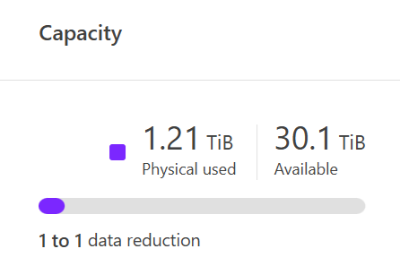

= Test 10: Capacity management
:toc: left
:toclevels: 4
:sectnums:
:icons: font
:source-highlighter: highlight.js
:doctype: book

xref:test-plans.adoc[← Back to Test Plans]

[[capacity-management]]
== Capacity management

Viewing and managing capacity in NetApp AFX has been streamlined to improve simplicity and understanding of what capacity you actually have available. Aggregates as a managed construct are removed. Instead, volumes and the new Storage Availability Zone concept are how we view and managed capacity. This test plan shows different ways capacity is managed in NetApp AFX.

[cols="1"]
|===
| *Test plan 10 - Capacity management*

a| Test procedure – GUI: +
View capacity in the dashboard.

From the CLI +
Display the Storage Availability Zone

[source,console]
----
AFX::> storage availability-zone show
Display the cluster space
AFX::> cluster space show
----

a| Expected outcome(s): +
Capacity views should be easy to understand. +
Storage availability zones should simplify capacity use.

| *Test results:*

| *Test summary:*

| *Comments:*

|===

// navigation-links:start
[cols="1,1",frame=none,grid=none]
|===
| xref:test-09-performance-monitoring.adoc[< Previous]
>| xref:test-11-compute-scaling.adoc[Next >]
|===
// navigation-links:end
