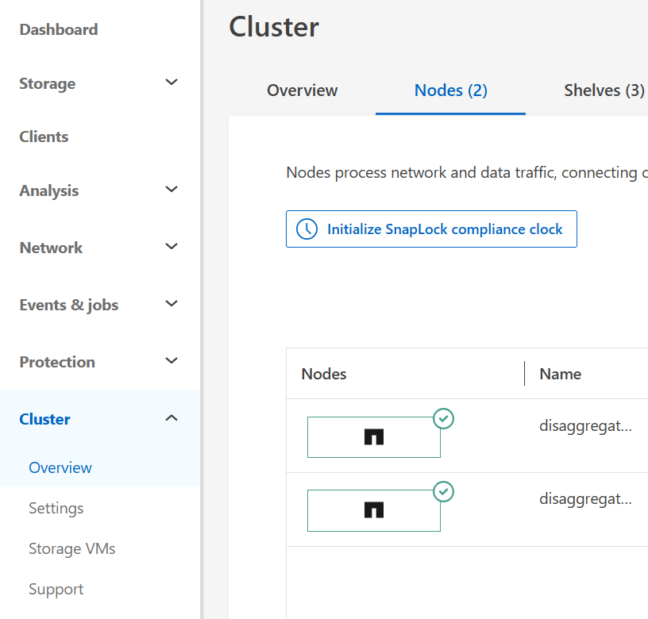
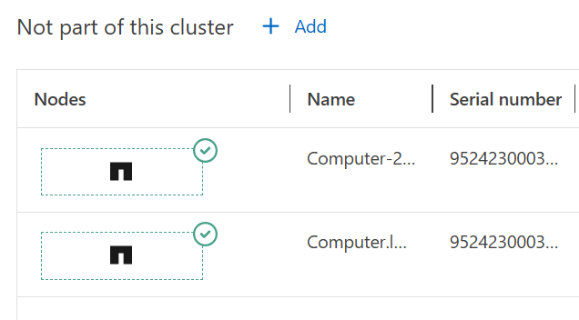
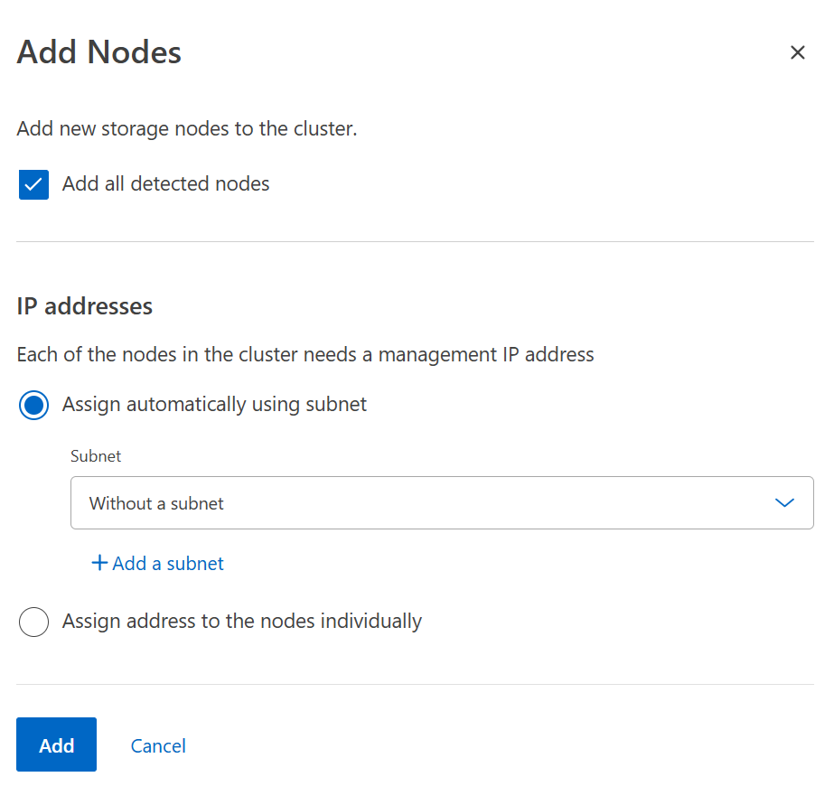
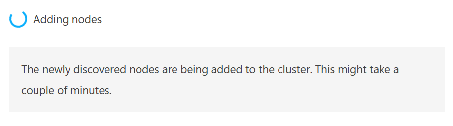
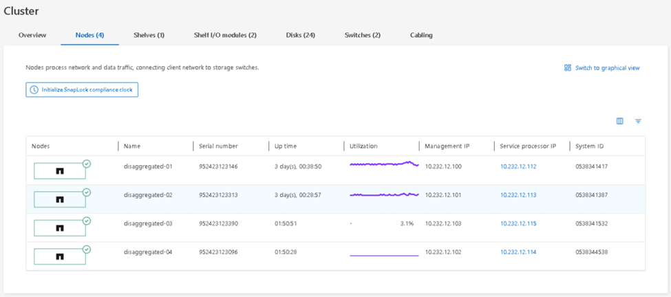

= Test 11: Compute scaling (optional)
:toc: left
:toclevels: 4
:sectnums:
:icons: font
:source-highlighter: highlight.js
:doctype: book

xref:test-plans.adoc[← Back to Test Plans]

[[compute-scaling-optional]]
== Compute scaling (optional)

One of the main benefits of NetApp AFX is the ability to scale compute and capacity independently. In this test, we will add 2 additional storage nodes to a 2-node NetApp AFX cluster during live workloads to verify that node additions are not only nondisruptive, but also increase performance scale linearly as volumes are rebalanced across nodes. This can also be done with other node count options (ie, starting with 4 nodes and adding 4 more nodes for an 8 node cluster).

[cols="<1",width="100%"]
|===
<| *Test plan 11 - Compute scaling (optional)*

a| *Test procedure:*

. Ensure benchmarks or performance workloads are running during these tests. Note the current average throughput and IOPS.
[source,console]
----
AFX::> set advanced
AFX::*> qos statistics volume performance show -vserver svm1 -volume [volname]
----

. Check volume location of current nodes. Note the number of volumes per node.
[source,console]
----
AFX::> set advanced
AFX::*> vol show -fields node,size,constituent-count -is-constituent true -node *
----

. Log into the service processor of the node(s) you wish to add to the cluster. 

To access the node's console: 
[source,console]
----
BMC> system console
----

If the node is not at the LOADER prompt, you can use ctl+d to exit to the BMC/service processor prompt and type “system reset” then answer y for dirty shutdown, then “system console” to watch the boot process. 

Hit ctl+c when you see the “interrupt Autoboot” message. Once at the LOADER prompt, run the following: 
[source,console]
----
LOADER> set-defaults setenv bootarg.init.unjoined true saveenv 
----

Then, boot the node to the boot menu prompt.
[source,console]
----
LOADER> boot_ontap menu

Select option 4 from the menu. Please choose one of the following:
(1)  Normal Boot. 
(2)  Boot without /etc/rc. 
(3)  Change password. 
(4)  Initialize and configure system. 
(5)  Maintenance mode boot. 
(6)  Update flash from backup config. 
(7)  Install new software first. 
(8)  Reboot node. 
(9)  Clean System Configuration. 
(10) Set Onboard Key Manager recovery secrets. 
(11) Configure node for external key management. 

Selection (1-11)? 4
----
. If prompted, type yes:
[source,console]
----
WARNING: This node may not have been properly unjoined from an existing cluster,                                                                              please confirm before using option (4)
----
+
[source,console]
----
WARNING: This node may not have been properly unjoined from an existing cluster.                                                                              Please confirm before continuing with option 4.
Zero disks, reset config and install a new file system?: yes
If you get sent back to LOADER from here, type boot_ontap at the LOADER prompt
----

. Use the cluster setup wizard to configure a node management LIF/subnet/gateway. This will be used by System Manager to detect the node for addition into the cluster. Places to input information highlighted in yellow. Welcome to the cluster setup wizard.

. You can enter the following commands at any time: "help" or "?" - if you want to have a question clarified, "back" - if you want to change previously answered questions, and "exit" or "quit" - if you want to quit the cluster setup wizard. Any changes you made before quitting will be saved.

. You can return to cluster setup at any time by typing "cluster setup". To accept a default or omit a question, do not enter a value.

. This system will send event messages and periodic reports to NetApp Technical Support. To disable this feature, enter autosupport modify -support disable within 24 hours.

. Enabling AutoSupport can significantly speed problem determination and resolution, should a problem occur on your system. For further information on AutoSupport, see: https://support.netapp.com/autosupport/

. Type yes to confirm and continue {yes}: yes May 16 02:26:09 [localhost:asup.general.optout:notice]: AutoSupport will be enabled 24 hours after system initialization.

. Enter the node management interface port [e0M]: Enter the node management interface IP address: 10.232.12.128 Enter the node management interface netmask: 255.255.254.0 Enter the node management interface default gateway: 10.232.12.1 A node management interface on port e0M with IP address 10.232.12.128 has been created.

. Press CTL+C and enter the cluster CLI to modify the cluster interconnect IP addresses, as they auto create and may not be routable on your network. If you get a login: prompt, use admin. There will be no password here. This step is only needed if the other cluster interfaces on existing ndoes do not use the 169.254.x.x addresses that ONTAP auto creates. In most cases, you can leave these as defaults.
+
[source,console]
----
::> net int show -role cluster
  (network interface show)
            Logical    Status     Network            Current       Current Is
Vserver     Interface  Admin/Oper Address/Mask       Node          Port    Home
----------- ---------- ---------- ------------------ ------------- ------- ----
Cluster
            clus1        up/up    169.254.118.206/16 localhost     e7a     true
            clus2        up/up    169.254.220.172/16 localhost     e7b     true
2 entries were displayed.
----
+
[source,console]
----
::> net int modify -vserver Cluster -lif clus1 -address 192.168.76.222
  (network interface modify)
----
+
[source,console]
----
::> net int modify -vserver Cluster -lif clus2 -address 192.168.76.226
  (network interface modify)
----

. Repeat the above setup steps on the other NetApp AFX node(s).

. From here, access the System Manager window via the cluster management IP. Navigate to Cluster -> Overview and click on the “Nodes” tab.
+

. At the bottom of the page, you should see a section called “Not part of this cluster” and your new nodes below that. Click “+ Add” to add the node to the cluster. An odd number of nodes cannot be added to a cluster. If the nodes are discovered before the cluster interconnect IP addresses are changed, then you will need to re-discover the nodes by exiting the window and navigating back. If the GUI addition does not work, try the CLI command cluster add-node instead If issues persist, utilize contact NetApp support or reach out to [email].
+

. Use the “Add nodes” screen to fill in your information. Management IP addresses can be added manually or by using a subnet.
+

+

. Log into the cluster CLI. Monitor the node add status.
+
[source,console]
----
AFX::*> add-node-status
  (cluster add-node-status)
----

. Node Name        Cluster IP          Status              Error Reason
+
[source,console]
----
---------------- ------------------- ------------------- --------------------------
----
+
[source,console]
----
AFX-01           192.168.76.221      success
AFX-03           192.168.76.226      node-initialization
AFX-04           192.168.76.220      node-initialization
AFX-02           192.168.76.224      success
4 entries were displayed.
----

. OPTIONAL: Log into the system console of the nodes being added via the service processor and observe the steps being performed.

. Once the node adds have completed, check the volume placement across all nodes.
+
[source,console]
----
AFX::> set advanced
AFX::*> vol show -fields node,size,constituent-count -is-constituent true -node AFX-01
AFX::*> vol show -fields node,size,constituent-count -is-constituent true -node AFX-02
AFX::*> vol show -fields node,size,constituent-count -is-constituent true -node AFX-03
AFX::*> vol show -fields node,size,constituent-count -is-constituent true -node AFX-04
----

. Eventually, volumes should be distributed evenly across all nodes. Check back every 5 minutes or so. If disks are unavailable to one of the nodes (ie, bad switch config, bad cabling, card issues), then nodes will not add properly. If the node does not have two healthy cluster LIFs (ie a cluster port is down), the node will not add properly. Volumes will not move to unhealthy nodes/incomplete node joins.

. Add/configure new network interfaces for your SVM on a per-node basis to add performance to the workload. Add at least one per node for NFSv3 and at least two per node if using NFSv4.x.
+
[source,console]
----
AFX::> net int create -vserver [SVM] -lif [name] -address [10.10.10.10] -netmask [255.255.255.0] -home-node [node1] -home-port [port] -rdma-protocols [optional] -broadcast-domain [optional]
..
AFX::> net int create -vserver [SVM] -lif [name] -address [10.10.10.10] -netmask [255.255.255.0] -home-node [node4] -home-port [port] -rdma-protocols [optional] -broadcast-domain [optional]
----

. If you are using pNFS, you clear the device caches to ensure the new interfaces get picked up.
+
[source,console]
----
AFX::> set diag -c off
AFX::*> pnfs lif-mapping-cache flush -node *
AFX::*> pnfs devices cache flush -node * -vserver [SVM1]
AFX::*> pnfs devices invalidate -global-device-table-id *
----

. Verify if performance has increased for the currently running workload (throughput, CPU utilization, IOPS, etc.)
+
[source,console]
----
AFX::> set advanced
AFX::*> qos statistics volume performance show -vserver svm1 -volume [volname]
From System Manager, you can view the performance graph.
----
+

a| *Expected outcome(s):*

* Adding new nodes to the cluster should be nondisruptive.
* Volume moves should happen automatically and be nondisruptive.
* Performance should scale up linearly.
|===

// navigation-links:start
[cols="1,1",frame=none,grid=none]
|===
| xref:test-10-capacity-management.adoc[< Previous]
>| xref:test-12-node-failure-behavior.adoc[Next >]
|===
// navigation-links:end
