= Optional Test 13: FlexCache Volume Functionality
:toc: left
:toclevels: 4
:sectnums:
:icons: font
:source-highlighter: highlight.js
:doctype: book

xref:test-plans.adoc[← Back to Test Plans]

NetApp FlexCache volumes provide a way to localize reads on remote datasets by caching only the active working set.

[[optional-flexcache-volume-functionality]]
== OPTIONAL: FlexCache volume functionality

NetApp FlexCache volumes provide a way to localize reads on remote datasets by populating only the data in use in cache to conserve capacity utilization while maximizing read performance. The goal of this test is to illustrate that NetApp AFX can be used to connect to unified ONTAP to provide a small capacity footprint for read scaling without needing to copy an entire dataset, while adding compute nodes asymmetrically in NetApp AFX.

[cols="1,4",width="100%"]
|===
2+a| *Test procedure:*

. Navigate to the NetApp AFX System Manager and login

. Peer the clusters (if necessary) This step may not be necessary if you’ve already peered the clusters for SnapMirror. Follow the steps in the Data Migration test plan above to peer clusters.

. Create a SVM peer for the FlexCache volume You may need to re-peer the clusters in some cases.

. Navigate to “Cluster -> settings” Scroll down to Storage VM peers and click the menu and select “Add a storage VM peer”
+
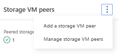

. Select the peered cluster and the desired SVM to peer.
+
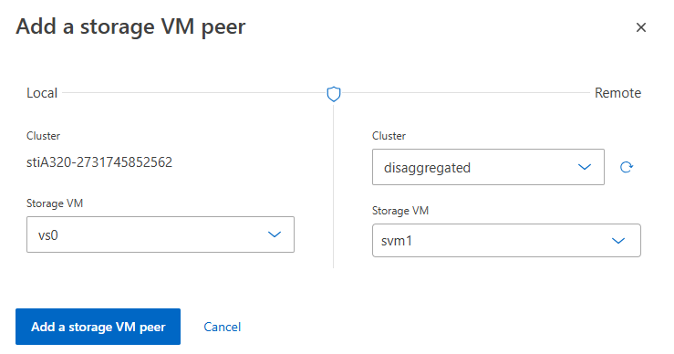

. Specify FlexCache as the application to use.

. Create the FlexCache volume Click on Storage -> Volumes and click “Add”
+
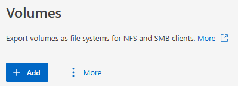

. In the Add volume window, click “More options”
+
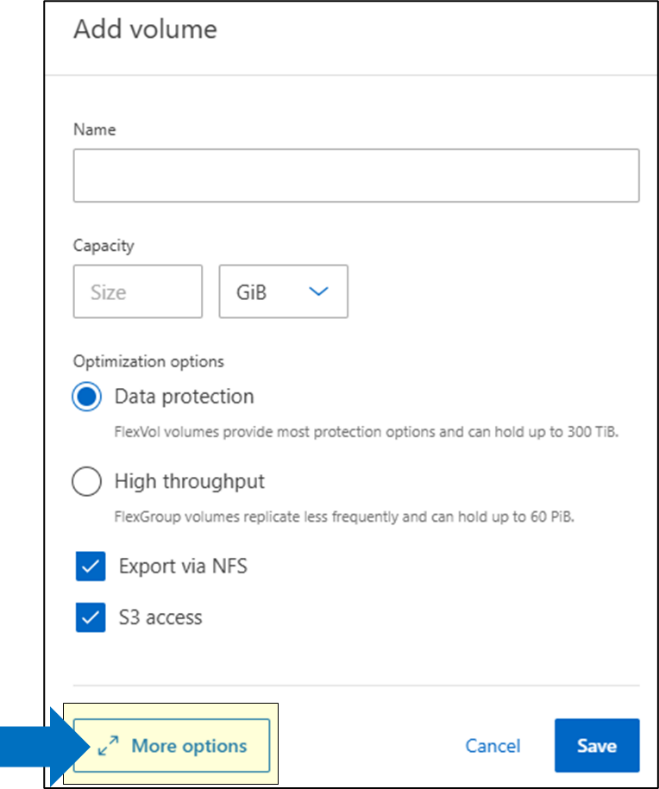

. Give the cache a name and select “Add as a cache for remote volume” below the name and select the cluster, SVM and volume to connect to as a cache.
+
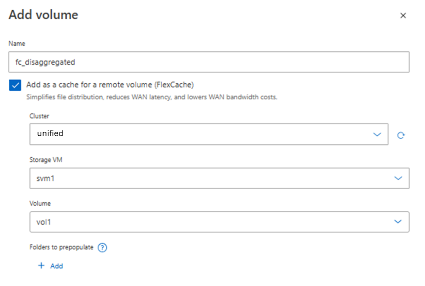

. Give the cache a size – it doesn’t have to be the same size as the origin volume – and configure the access permissions. FlexCache writeback is not currently supported for FlexGroup volumes in NetApp AFX.
+
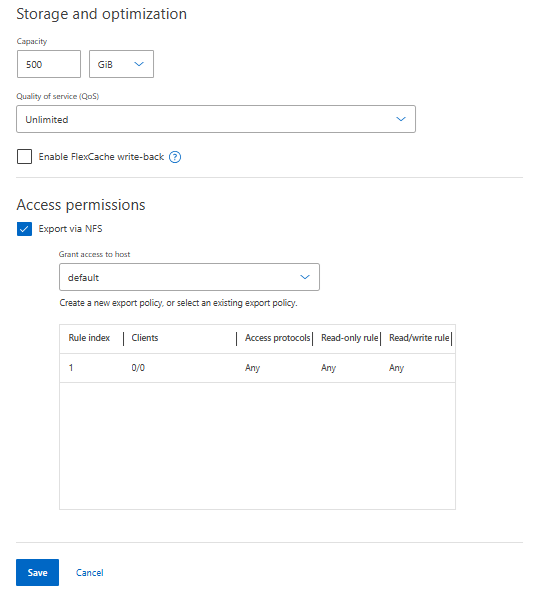

. Click save. The FlexCache will be created.
+
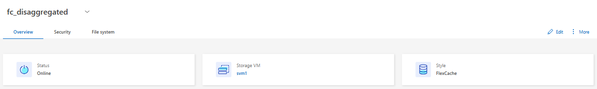

. Mount information is found on the volume detail page.
+
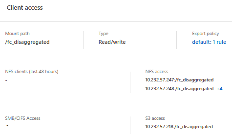

. When you mount the FlexCache on the client, the directory structure will match what is on the origin, but data will only populate on access.
+
[source,console]
----
# ls -la /origin
total 20
drwxrwxrwx  4 root root 4096 May 18 02:06 .
drwxr-xr-x 22 root root 4096 May 19 21:33 ..
drwxr-xr-x  2 root root 4096 May 18 02:17 host-configs
drwxrwxrwx  3 root root 4096 May 16 17:06 .snapshot
drwxr-xr-x  9 root root 4096 May 18 02:05 storage
----
+
[source,console]
----
# mount 10.193.67.203:/fc_AFX /cache/
# mount \| grep cache
10.193.67.203:/fc_AFX on /cache type nfs4 (rw,relatime,vers=4.1,rsize=262144,wsize=262144,namlen=255,hard,proto=tcp,timeo=600,retrans=2,sec=sys,clientaddr=10.193.67.223,local_lock=none,addr=10.193.67.203)
----
+
[source,console]
----
# ls -la /cache
total 16
drwxrwxrwx 4 root root 4096 May 18 02:06 .
drwxrwxrwx 9 root root 4096 May 23 23:54 ..
drwxr-xr-x 2 root root 4096 May 18 02:17 host-configs
drwxr-xr-x 9 root root 4096 May 18 02:05 storage
----

. FlexCache volumes can also be pre-populated if you know what data you need cached to reduce the initial latency hit on first read. In System Manager, on the FlexCache volume, click More and select “Prepopulate folders”
+
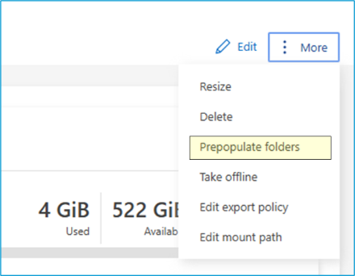

. Then, click “+Add” in the window to select the folder to populate. For instance, if you want to run a training job on Resnet50 data, specify the folder path with that data in it and click save.
+
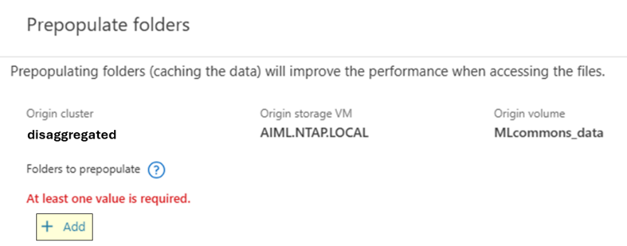
+
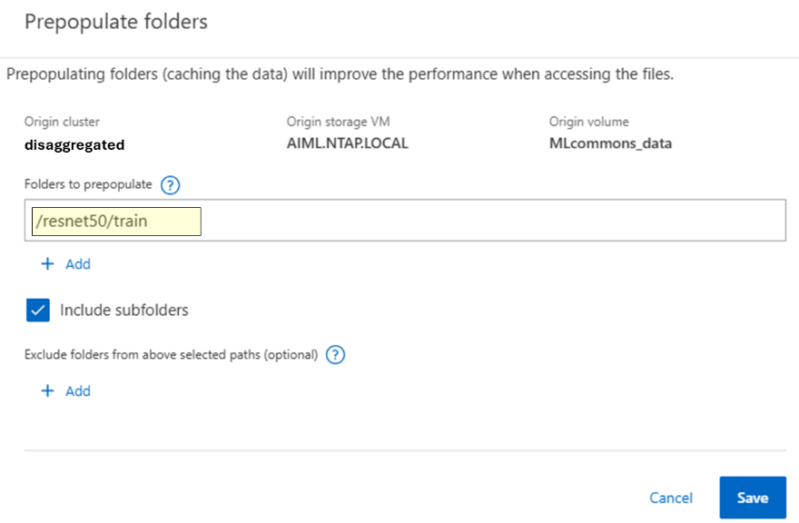

. As this happens, you will see the “Cache miss” graph get activity and the Capacity increase in real time in the System Manager view for the cache volume.
+
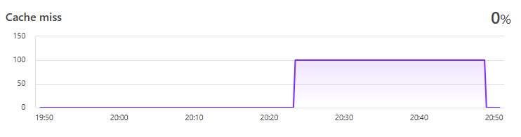
+
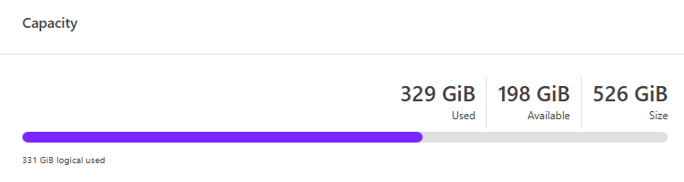

. The Resnet50 training folder in this test is ~320GB in size. The view in System Manager shows that capacity used after the pre-populate. Pre-populate can take some time to complete. The ~320GB test below took around 25 minutes to pre-populate data. Your data path will vary based on the data you have populated.
+
[source,console]
----
# du -h /aiml/dataset/resnet50/train
321G    /aiml/dataset/resnet50/train
----

. Run a performance test against the origin volume in unified ONTAP. Then, run it again on the pre-warmed FlexCache volume on the same dataset. Run a 2nd performance test against a different folder in unified ONTAP. Then, re-run it on a FlexCache that has not been pre-warmed to see the performance hit on a cache that needs to populate data.

2+a| *Expected outcome(s):*

* FlexCache peering and creation should be identical to how unified ONTAP creates FlexCache volumes.
* FlexCache in NetApp AFX should be able to leverage a unified ONTAP origin.
* FlexCache pre-populate should allow for pre-warming of cache data.
* FlexCache should improve read performance for local reads over remote reads.

|===
// navigation-links:start
[cols="1,1",frame=none,grid=none]
|===
| xref:test-12-node-failure-behavior.adoc[< Previous]
>| xref:test-s3.adoc[Next >]
|===
// navigation-links:end
