= Optional Test 14: S3 in ONTAP
:toc: left
:toclevels: 4
:sectnums:
:icons: font
:source-highlighter: highlight.js
:doctype: book

xref:test-plans.adoc[← Back to Test Plans]

This optional test plan covers S3 protocol configuration and testing on NetApp AFX.

[[optional-s3-in-ontap]]
== OPTIONAL: S3 in ONTAP

ONTAP provides S3 as a protocol for data access, as well as the ability to present datasets as both NAS and S3 in the same volume. This functionality is valuable to use cases looking to move to object for their applications, but still have legacy file shares in their environment. Providing a way to present data to any protocol in the same volume removes the requirement to copy large amounts of data to new locations.
This optional test plan covers configuration of S3 for use with the datasets created for performance benchmarking above.

[cols="1,4",width="100%"]
|===
2+a| *Test procedure:*

. Enable S3 on the SVM

. Navigate to Cluster -> Storage VMs
+
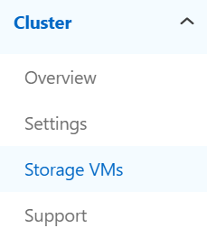

. Click on the desired SVM and look for the “Protocols” section. That shows if S3 is enabled.
+
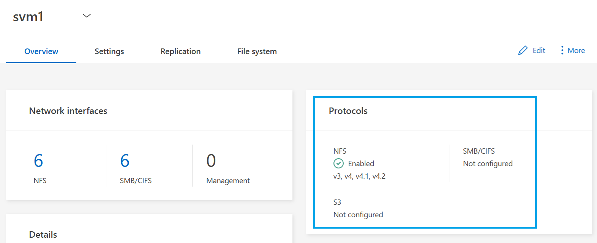

. Click on the “Settings” tab and then the settings icon on the S3 section.
+
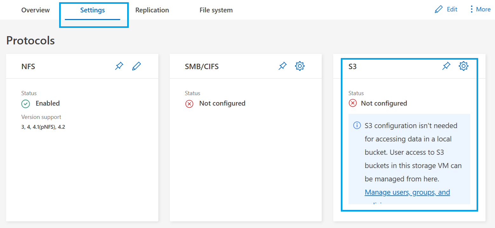

. Give the S3 server a name and configuration. This name should be a FQDN that is resolvable in DNS.
+
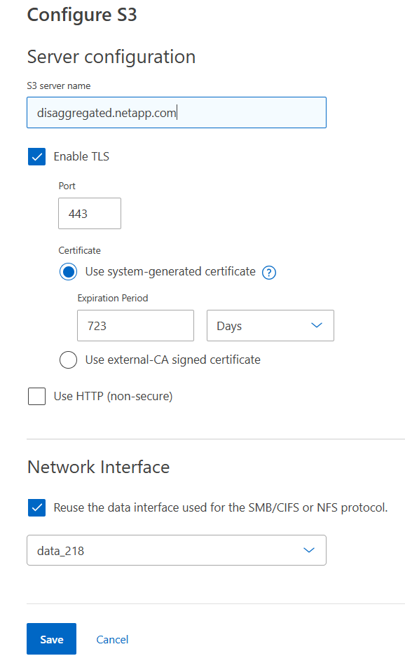

. If desired for this test plan, use HTTP to avoid requiring certificates.

. Click save. ONTAP will perform configurations behind the scenes, such as user creation, certificates, etc.

. Once it’s finished, a screen will pop up with information about the S3 server needed for authentication to the buckets. Download these or copy and save for future use.
+
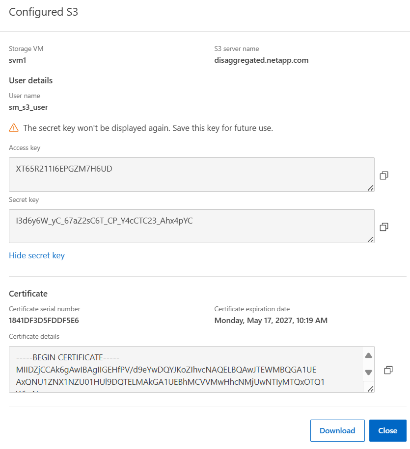

. To add a unique user, click on the S3 settings once S3 has been enabled.
+
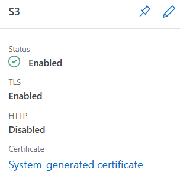
+
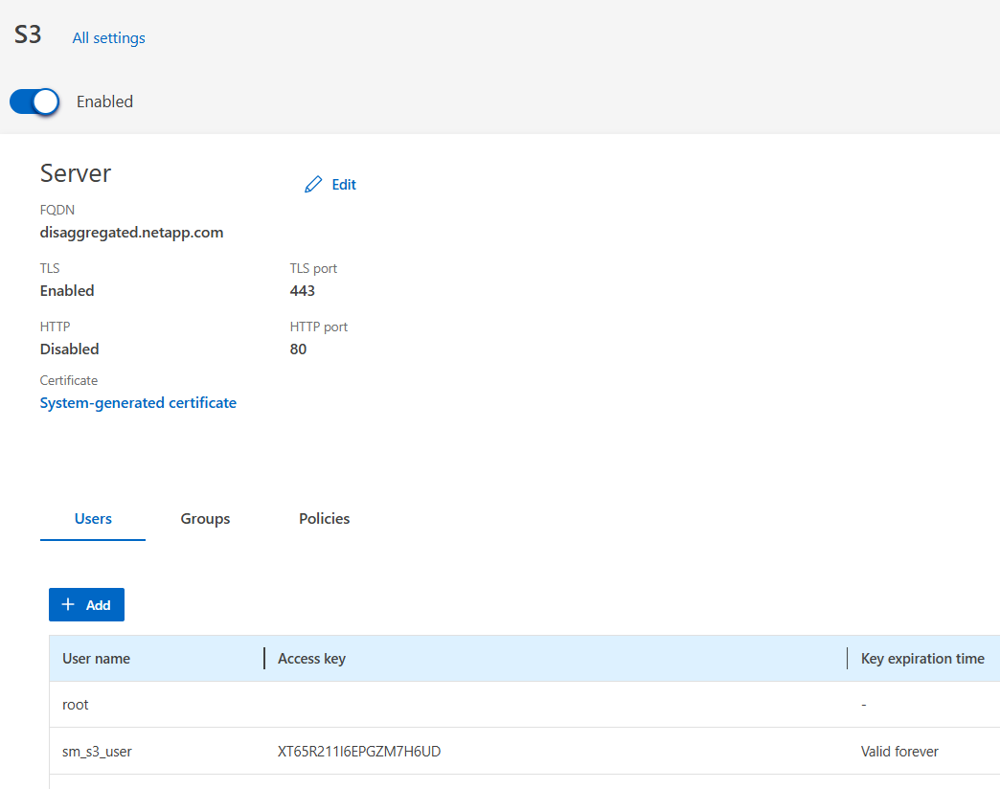

. An S3 user needs to map to a corresponding NAS user. If you want to use the root user, you need to generate a passkey for root. For root user, click the menu and “Regenerate key” and then save the information.
+
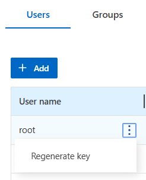

. To add a user, click “Add” and type the name and set the desired key validity. Remember, the user must map to a NAS user if you intend on leveraging NAS/Object protocol duality.
+
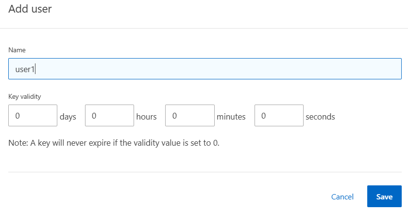

. This will create your access/secret keys. Save for later use.
+
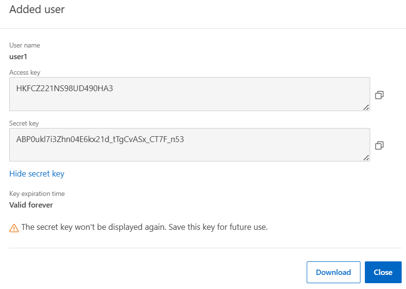

. Create an S3 bucket that can connect to the NAS volume for file/object duality. Navigate to Storage -> Buckets and then click “Add” and “More options” and add your name, SVM and map the bucket to a folder with the NAS data.
+
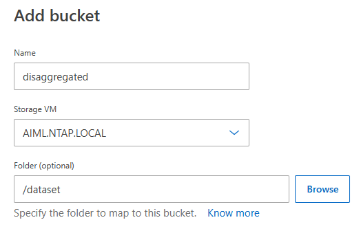

. If only one Storage VM is present, you will not need to select the Storage VM.

. Optionally, modify bucket permissions, users who have access, etc. Then click “Save.”
+
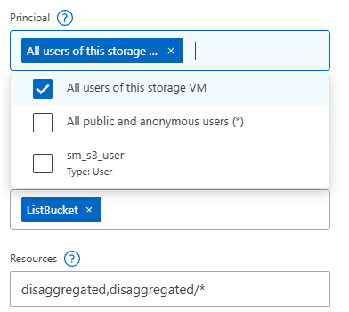
+
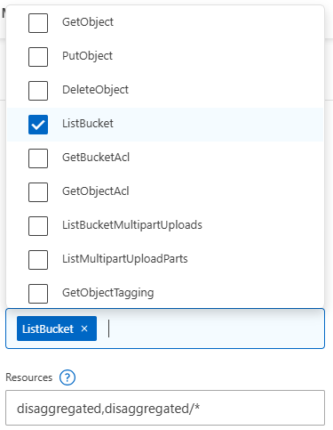

. Your bucket will be listed. Clicking on it allows you to manage it further and view the URL.
+
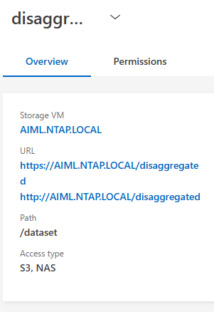

. Connect to a bucket from the client. The client should have an S3-capable client (such as s3fs for Linux). The client should have authentication configured for the client and user (ie, secret keys, certs, etc). The S3 server FQDN should be resolvable in DNS from client and server. The bucket mount command will attempt to use http(s)://bucket.url.domain.com during its connection. Add an A/AAAA DNS record or a local host entry to the client and use nslookup to test if the client can find the entry.

. On the client, this is an example command can be used to mount the S3 bucket that points to the NAS volume. Ubuntu 22.04 is used here.
+
[source,console]
----
# mkdir /mnt/s3_bucket
# s3fs AFX /mnt/s3_bucket/ -o passwd_file=${HOME}/.passwd-s3fs -o url=http://aiml.ntap.local
----

. To debug issues with bucket connections, use the following options:
+
[source,console]
----
# s3fs AFX /mnt/s3_bucket/ -o passwd_file=${HOME}/.passwd-s3fs -o url=http://aiml.ntap.local -o dbglevel=info -f -o curldbg
----

. This is an example of a bucket connection issue where the bucket name cannot be resolved.
+
[source,console]
----
025-05-22T19:33:42.849Z [CRT] s3fs_logger.cpp:LowSetLogLevel(240): change debug level from [CRT] to [INF]
2025-05-22T19:33:42.849Z [INF]     s3fs.cpp:set_mountpoint_attribute(4093): PROC(uid=0, gid=0) - MountPoint(uid=0, gid=0, mode=40755)
2025-05-22T19:33:42.852Z [INF] curl.cpp:InitMimeType(434): Loaded mime information from /etc/mime.types
2025-05-22T19:33:42.852Z [INF] fdcache_stat.cpp:CheckCacheFileStatTopDir(79): The path to cache top dir is empty, thus not need to check permission.
2025-05-22T19:33:42.853Z [INF] s3fs.cpp:s3fs_init(3382): init v1.90(commit:unknown) with GnuTLS(gcrypt)
2025-05-22T19:33:42.853Z [INF] s3fs.cpp:s3fs_check_service(3516): check services.
2025-05-22T19:33:42.853Z [INF]       curl.cpp:CheckBucket(3388): check a bucket.
2025-05-22T19:33:42.853Z [INF]       curl_util.cpp:prepare_url(254): URL is http://aiml.ntap.local/AFX/
2025-05-22T19:33:42.853Z [INF]       curl_util.cpp:prepare_url(287): URL changed is http://AFX.aiml.ntap.local/
2025-05-22T19:33:42.853Z [INF]       curl.cpp:insertV4Headers(2680): computing signature [GET] [/] [] []
2025-05-22T19:33:42.853Z [INF]       curl_util.cpp:url_to_host(331): url is http://aiml.ntap.local
2025-05-22T19:33:42.858Z [CURL DBG] * Could not resolve host: AFX.aiml.ntap.local
----

. This is an example of a successful connection:
+
[source,console]
----
2025-05-22T19:41:52.736Z [INF] s3fs version 1.90(unknown) : s3fs -o passwd_file=/root/.passwd-s3fs -o url=http://aiml.ntap.local -o dbglevel=info -f -o curldbg AFX /mnt/s3_bucket/
2025-05-22T19:41:52.736Z [CRT] s3fs_logger.cpp:LowSetLogLevel(240): change debug level from [CRT] to [INF]
2025-05-22T19:41:52.736Z [INF]     s3fs.cpp:set_mountpoint_attribute(4093): PROC(uid=0, gid=0) - MountPoint(uid=0, gid=0, mode=40755)
2025-05-22T19:41:52.740Z [INF] curl.cpp:InitMimeType(434): Loaded mime information from /etc/mime.types
2025-05-22T19:41:52.740Z [INF] fdcache_stat.cpp:CheckCacheFileStatTopDir(79): The path to cache top dir is empty, thus not need to check permission.
2025-05-22T19:41:52.742Z [INF] s3fs.cpp:s3fs_init(3382): init v1.90(commit:unknown) with GnuTLS(gcrypt)
2025-05-22T19:41:52.742Z [INF] s3fs.cpp:s3fs_check_service(3516): check services.
2025-05-22T19:41:52.742Z [INF]       curl.cpp:CheckBucket(3388): check a bucket.
2025-05-22T19:41:52.742Z [INF]       curl_util.cpp:prepare_url(254): URL is http://aiml.ntap.local/AFX/
2025-05-22T19:41:52.742Z [INF]       curl_util.cpp:prepare_url(287): URL changed is http://AFX.aiml.ntap.local/
2025-05-22T19:41:52.742Z [INF]       curl.cpp:insertV4Headers(2680): computing signature [GET] [/] [] []
2025-05-22T19:41:52.743Z [INF]       curl_util.cpp:url_to_host(331): url is http://aiml.ntap.local
2025-05-22T19:41:52.744Z [CURL DBG] *   Trying 10.192.160.180:80...
2025-05-22T19:41:52.744Z [CURL DBG] * Connected to AFX.aiml.ntap.local (10.192.160.180) port 80 (#0)
2025-05-22T19:41:52.745Z [CURL DBG] > GET / HTTP/1.1
2025-05-22T19:41:52.745Z [CURL DBG] > Host: AFX.aiml.ntap.local
2025-05-22T19:41:52.745Z [CURL DBG] > User-Agent: s3fs/1.90 (commit hash unknown; GnuTLS(gcrypt))
2025-05-22T19:41:52.745Z [CURL DBG] > Accept: */*
2025-05-22T19:41:52.745Z [CURL DBG] > Authorization: AWS4-HMAC-SHA256 Credential=PHRPD501WA9RLX7VRS6T/20250522/us-east-1/s3/aws4_request, SignedHeaders=host;x-amz-content-sha256;x-amz-date, Signature=ec6cdc2aec82efd31320ed34cf7d0ff4710ccf3dc5294cf93e5d257ab5fd64e4
2025-05-22T19:41:52.745Z [CURL DBG] > x-amz-content-sha256: e3b0c44298fc1c149afbf4c8996fb92427ae41e4649b934ca495991b7852b855
2025-05-22T19:41:52.745Z [CURL DBG] > x-amz-date: 20250522T194152Z
2025-05-22T19:41:52.745Z [CURL DBG] >
2025-05-22T19:41:55.097Z [CURL DBG] * Mark bundle as not supporting multiuse
2025-05-22T19:41:55.097Z [CURL DBG] < HTTP/1.1 200 OK
2025-05-22T19:41:55.097Z [CURL DBG] < Server: NetApp NAS/9.16.1
2025-05-22T19:41:55.097Z [CURL DBG] < Date: Thu, 22 May 2025 19:43:58 GMT
2025-05-22T19:41:55.097Z [CURL DBG] < x-amz-request-id: 1461343388
2025-05-22T19:41:55.097Z [CURL DBG] < Content-Length: 170639
2025-05-22T19:41:55.097Z [CURL DBG] < Content-Type: application/xml
2025-05-22T19:41:55.097Z [CURL DBG] < Accept-Ranges: bytes
Once a bucket has been connected, you should be able to navigate the mount point to the files and folders within it. Compare the listings with the NFS mount.
Empty folders in an S3 bucket will show errors.
# ls /mnt/s3_bucket/
ls: cannot access '/mnt/s3_bucket/cosmoflow': No such file or directory
cosmoflow mlps-results  resnet50  unet3d
----
+
[source,console]
----
# ls /mnt/s3_bucket/resnet50/train/
img_0000_of_2395.tfrecord  img_0479_of_2395.tfrecord  img_0958_of_2395.tfrecord  img_1437_of_2395.tfrecord  img_1916_of_2395.tfrecord
img_0001_of_2395.tfrecord  img_0480_of_2395.tfrecord  img_0959_of_2395.tfrecord  img_1438_of_2395.tfrecord  img_1917_of_2395.tfrecord
----
+
[source,console]
----
# ls /mnt/nfs/resnet50/train/
img_0000_of_2395.tfrecord  img_0479_of_2395.tfrecord  img_0958_of_2395.tfrecord  img_1437_of_2395.tfrecord  img_1916_of_2395.tfrecord
img_0001_of_2395.tfrecord  img_0480_of_2395.tfrecord  img_0959_of_2395.tfrecord  img_1438_of_2395.tfrecord  img_1917_of_2395.tfrecord
----

. New files created via NFS will immediately show in the S3 bucket. Permissions will reflect the access settings you created on the bucket.
+
[source,console]
----
# touch /mnt/nfs/testfile
# ls -la /mnt/nfs/testfile
-rw-r--r-- 1 root root 0 May 22  2025 /aiml/dataset/testfile
----
+
[source,console]
----
# ls -la /mnt/s3_bucket/testfile
-rw-r----- 1 root root 0 May 22  2025 /mnt/s3_bucket/testfile
----

2+a| *Expected outcome(s):*

* A volume will be able to be presented to both NAS and object clients.
* The same data is accessible to both NAS and object clients without needing to move.

|===
// navigation-links:start
[cols="1,1",frame=none,grid=none]
|===
| xref:test-flexcache.adoc[< Previous]
>| xref:test-snapshots-snapmirror.adoc[Next >]
|===
// navigation-links:end
